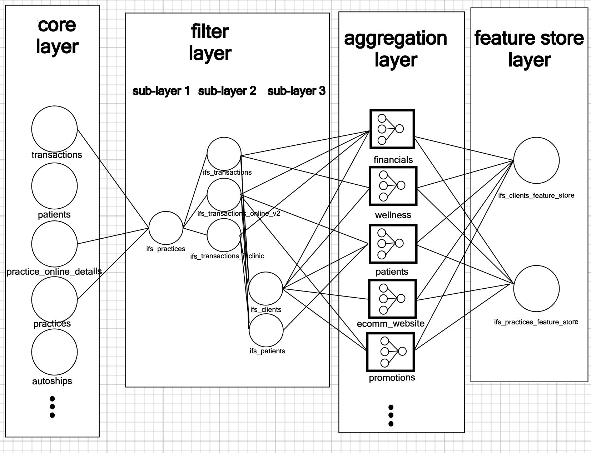

# Integrated Feature Store

## Overview
_Summarize the goal of your work and what motivated it._

High-Level Goal: Chris Johnson and I are trying to provide I&A with DBT post-core models that serve as a standardized feature store for future analyses that look at clients from clinics with complete integration status. This is the first pass of this, building stuff out at a client grain first. (then we will do clinics)

## Impact
- Addition and integration of new/pre-existing features on a client grain (client/clinic comparative revenue quantiles across channels, average us income by zipcode, etc.). The breadth of features should allow for more useful and detailed segmentation of both clients (pet owners) and clinics.
- A standardized environment to build and store features that analytics folks can both add to and use for analytics projects. Whenever we spin up a customer churn, RFM, client channel analysis--we should be using standardized features and not re-inventing the wheel each time. Currently, we lack standardization for building out analyses looking at different client types / practice types across multiple purchasing channels, looking at financial metrics at client, clinic and global (all clinic) scales.

## Design
Since we're trying to tie in a lot of different sources here, create features, and stitch back together to the client grain, we should do a modular and scalable approach.

1. ***Filter Layer***

transactions_inclinic/ transactions and are extremely large (~4Bill rows). We are only looking at clients from clinics with complete integration status and HD transactions here. This layer filters down the core tables so we're working with only the data that we need.

2. ***Aggregation Layer***

This layer modularizes the aggregations that we are doing in creating metrics across different aspects of the client (financials, ecomm_website engagement, types of purchases inclinic, etc)

4. ***Feature Store Layer***

This is the final layer where we stitch everything together on the client grain

Why do it this way?

***Modularity***: By breaking down the process into distinct layers, we can manage complexity and make the dbt models more maintainable and reusable.

***Performance Optimization***: Filtering and aggregating data in separate steps can help optimize query performance, especially when dealing with large datasets. This approach ensures that we work with smaller, more manageable datasets at each stage.

***Clarity and Documentation***: Separating concerns into different layers makes it easier to document and understand the purpose and logic of each model. This can be helpful for introducing new team members to the modelling or for debugging and maintaining the models.

***Scalability***: This layered approach allows us to scale our data transformations more effectively. As the data grows, we can optimize each layer independently to handle the increased load.

## Cadence
- we would opt to run this monthly since it is rather large.

Attached is a rough schematic of the current DAG design approach for this project.

